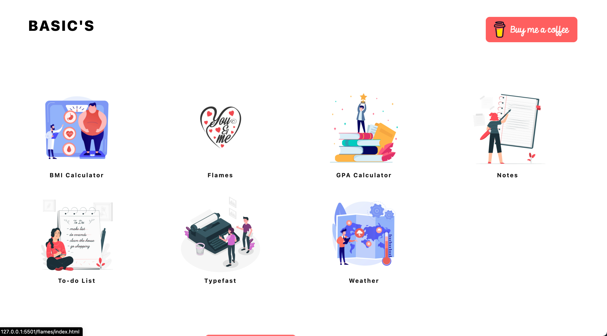
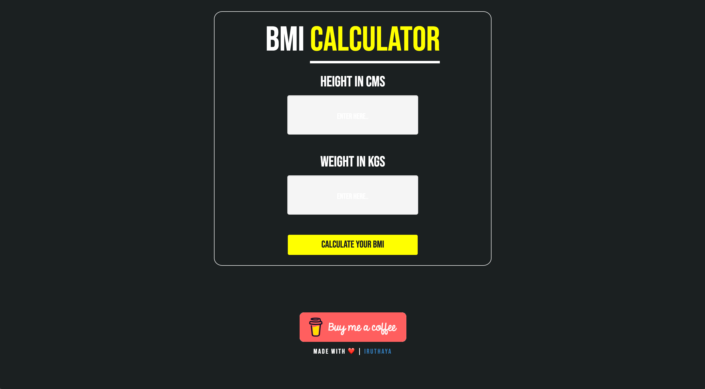
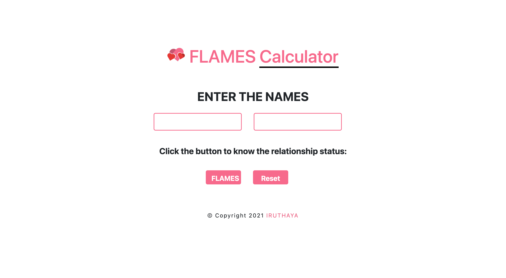
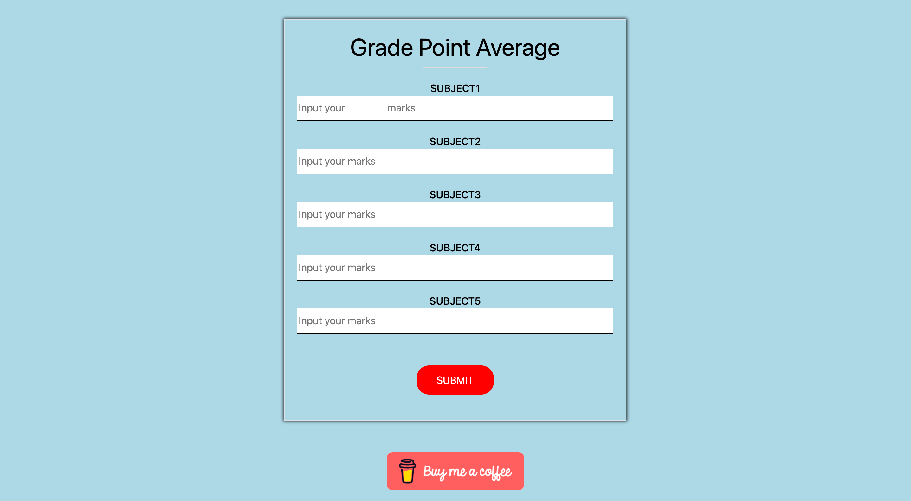
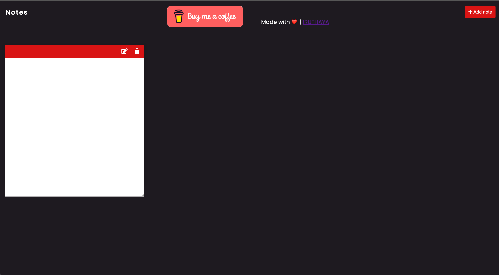
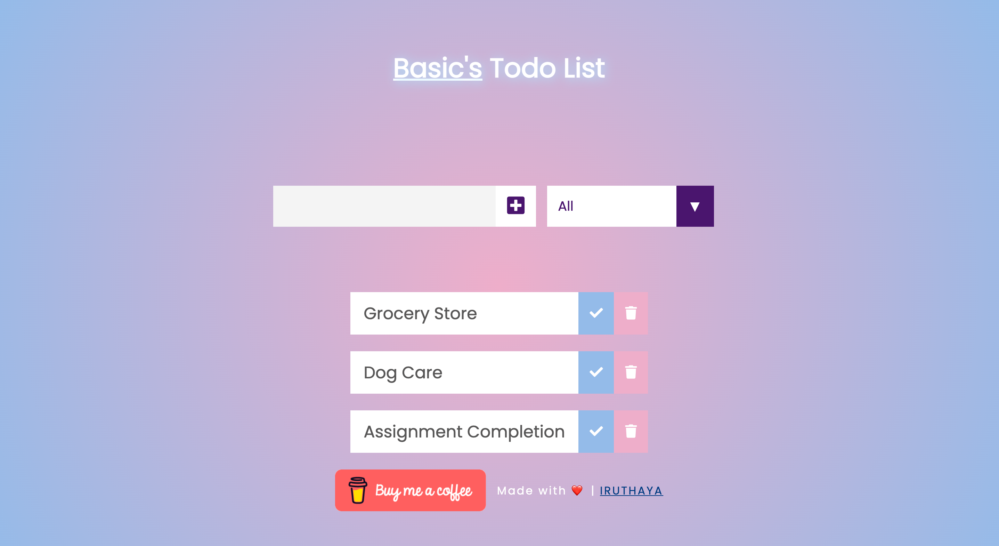
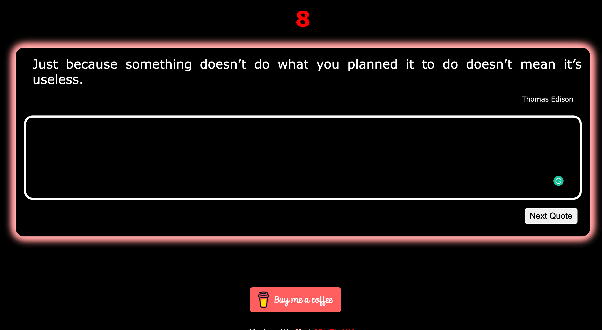
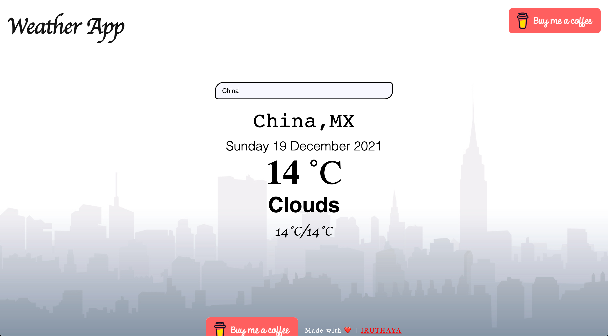

# BASIC Web App

## HTML + CSS + JS

### 100% Responsive.

> Live [demo](https://iruthayasanthose.github.io/dark-mode/).

## Table of Contents

- [General Info](#general-information)
- [Technologies Used](#technologies-used)
- [Screenshots](#screenshots)
- [Future Updates](#future-updates)
- [Project Status](#project-status)
- [Contact](#contact)

## General Information

BASIC is a web application contains basic applications related to studies, love, health, weather, productivity. This project aim to simply the user's life in anyway. Supported by all operating system, need an internet connection for working properly.

#### Applications

- BMI Calculator App
- Flames App
- GPA Calculator App
- Note Taking App
- Todo List App
- Typefast App
- Weather App

## Technologies Used

- HTML5
- CSS3
- Javascript

## Screenshots

## Future Updates

- PWA Implementation

## Project Status

Project is: _complete_

## Contact

Created by [@iruthaya\_\_](https://www.instagram.com/iruthaya__/) - feel free to contact me!
IRUTHAYA SANTHOSE I
